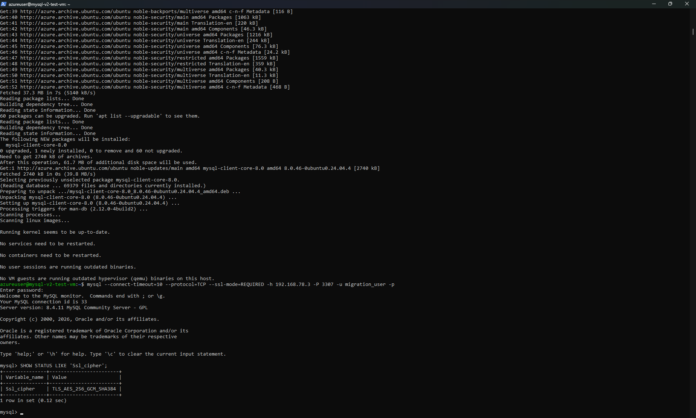
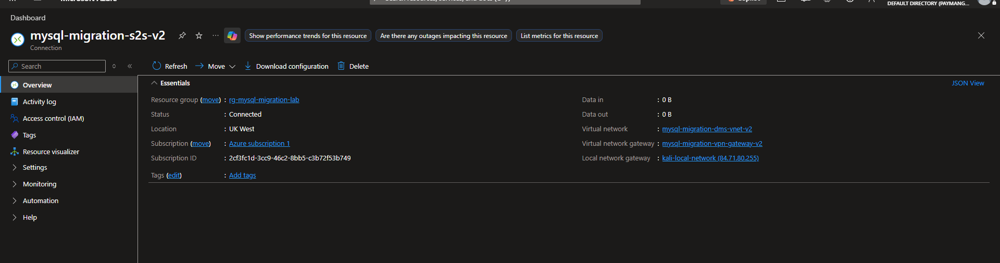
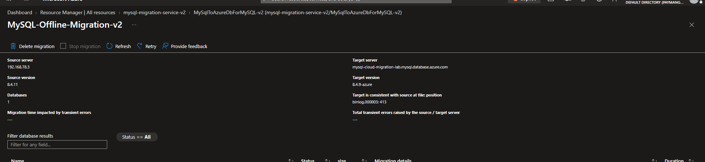
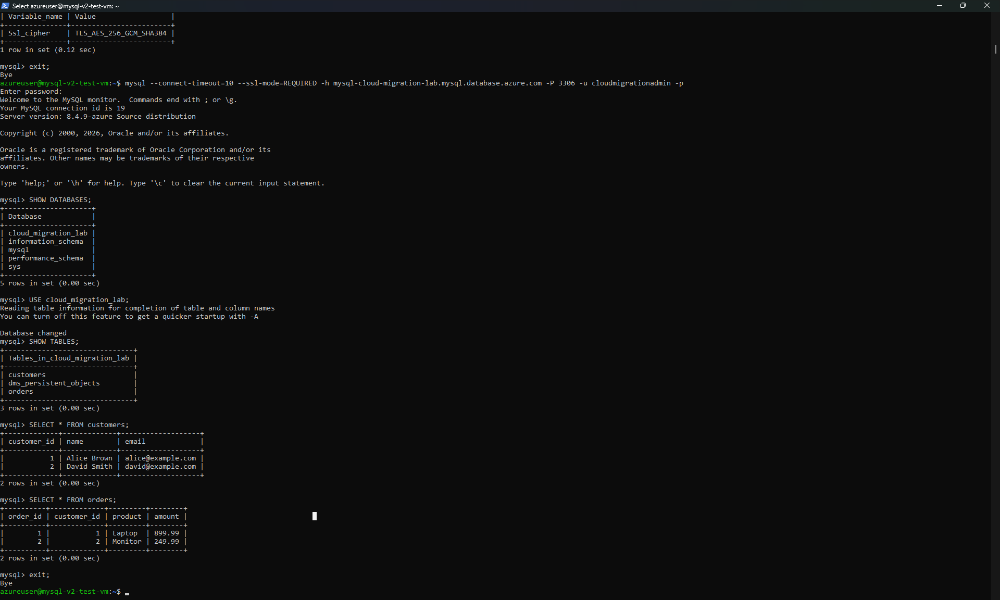

# Project Evidence

This folder contains selected screenshots captured during the secure MySQL migration project.

The evidence demonstrates key stages of the implementation and successful migration.

## 1. TLS-Secured MySQL Connectivity

Verifies an encrypted connection to the MySQL source and confirms the negotiated TLS cipher.

## 2. Site-to-Site VPN Connectivity

Shows the Azure site-to-site VPN connection in a connected state, providing secure hybrid connectivity between the local environment and Azure.

## 3. Azure Database Migration Service

Shows the successful Azure Database Migration Service execution, with the migration completed and 2 of 2 tables migrated.

## 4. Independent Post-Migration Verification

Confirms the migrated database, tables and sample records directly on the Azure Database for MySQL target after migration.

## Security

Sensitive information such as passwords, private SSH keys and VPN pre-shared keys has been excluded. Azure portal screenshots were also prepared for public portfolio use by removing unnecessary account/browser information.
